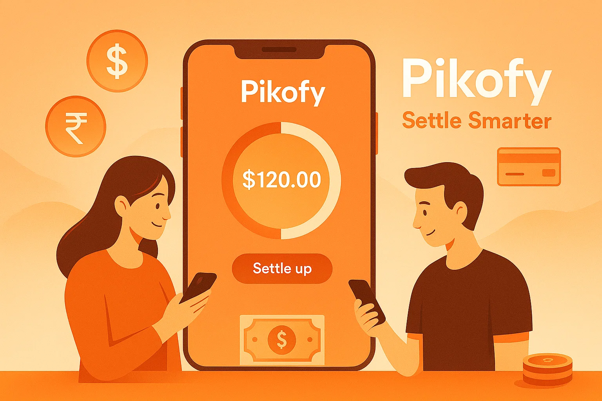

🚀 Pikofy - Smart Expense Splitting Platform
<div align="center">
Show Image

The smartest way to split expenses with friends

Show Image
Show Image
Show Image
Show Image

Demo • Features • Getting Started • Tech Stack

</div>
✨ Features
💳 Expense Management
Create individual or group expenses with smart categorization
Flexible splitting methods: equal, percentage, or exact amounts
Auto-suggest categories based on description
Support for 20+ expense categories
👥 Group Collaboration
Create unlimited expense groups
Role-based access (admin/member)
Real-time activity logs
Bulk member management with email notifications
📊 Smart Analytics
Visual spending insights with interactive charts
Monthly spending trends
Category-wise breakdowns
AI-powered spending insights (via Gemini)
⚖️ Intelligent Settlements
Net balance calculations across all expenses
Direction-aware settlement validation
Automatic orphan cleanup
Group and 1-on-1 settlement support
🔔 Smart Notifications
Payment reminder emails (daily cron)
Monthly spending insights with AI analysis
Group activity notifications
Member addition alerts
🛠️ Tech Stack
<table> <tr> <td align="center" width="96">  <br>Next.js 16 </td> <td align="center" width="96">  <br>React 19 </td> <td align="center" width="96">  <br>Tailwind 4 </td> <td align="center" width="96">  <br>TypeScript </td> </tr> <tr> <td align="center" width="96">  <br>Convex </td> <td align="center" width="96">  <br>Clerk Auth </td> <td align="center" width="96">  <br>Inngest </td> <td align="center" width="96">  <br>Gemini AI </td> </tr> </table>
Core Technologies
Frontend: Next.js 16 (App Router), React 19, Tailwind CSS 4
Backend: Convex (serverless backend with real-time sync)
Authentication: Clerk (OAuth & email/password)
Database: Convex (real-time, reactive queries)
Cron Jobs: Inngest (scheduled tasks & workflows)
AI: Google Gemini (spending insights)
Email: Nodemailer (SMTP notifications)
UI Components: Radix UI, shadcn/ui
Charts: Recharts
Forms: React Hook Form + Zod validation
🚀 Getting Started
Prerequisites
Node.js 18+ and npm/yarn/pnpm
Convex account (convex.dev)
Clerk account (clerk.com)
Gmail account (for SMTP)
Google AI API key (ai.google.dev)
Installation
Clone the repository
bash
git clone https://github.com/yourusername/pikofy.git
cd pikofy
Install dependencies
bash
npm install
Set up environment variables
Create .env.local:

env
# Convex
NEXT_PUBLIC_CONVEX_URL=your_convex_url
CONVEX_DEPLOYMENT=your_deployment

# Clerk
NEXT_PUBLIC_CLERK_PUBLISHABLE_KEY=your_clerk_key
CLERK_SECRET_KEY=your_clerk_secret
CLERK_JWT_ISSUER_DOMAIN=your_clerk_domain

# Email (Gmail SMTP)
GMAIL_USER=your_email@gmail.com
GMAIL_APP_PASSWORD=your_app_password

# AI
GEMINI_API_KEY=your_gemini_key

# Inngest
INNGEST_EVENT_KEY=your_inngest_key

# App
NEXT_PUBLIC_APP_URL=http://localhost:3000
Set up Convex
bash
npx convex dev
Run the development server
bash
npm run dev
```

Visit [http://localhost:3000](http://localhost:3000) 🎉

---

## 📁 Project Structure
```
pikofy/
├── app/
│   ├── (auth)/              # Authentication pages
│   ├── (main)/              # Protected app pages
│   │   ├── dashboard/       # Main dashboard
│   │   ├── expenses/        # Expense management
│   │   ├── contacts/        # Users & groups
│   │   ├── groups/          # Group details
│   │   └── settlements/     # Payment settlements
│   └── api/                 # API routes (Inngest)
├── components/
│   ├── ui/                  # Reusable UI components
│   └── [feature].jsx        # Feature-specific components
├── convex/
│   ├── schema.js            # Database schema
│   ├── users.js             # User queries/mutations
│   ├── expenses.js          # Expense logic
│   ├── groups.js            # Group management
│   ├── settlements.js       # Settlement logic
│   └── inngest.js           # Cron job queries
├── lib/
│   ├── inngest/             # Inngest functions
│   ├── expense-categories.js
│   └── utils.js
└── hooks/
    └── use-convex-query.jsx # Custom Convex hooks
🎯 Key Features Explained
Smart Balance Calculation
Uses a unified ledger system that:

Aggregates all expenses (1-on-1 + group)
Applies settlements to reduce balances
Prevents incorrect settlement directions
Handles floating-point precision issues
AI-Powered Insights
Monthly emails with:

Spending analysis by category
Personalized saving tips
Top spending alerts
Budget recommendations
Real-time Sync
Instant updates across all devices
Optimistic UI updates
Conflict-free collaborative editing
Sub-100ms query latency
📸 Screenshots
<div align="center">  <p><i>Beautiful, intuitive dashboard</i></p> </div>
🤝 Contributing
Contributions are welcome! Please feel free to submit a Pull Request.

Fork the project
Create your feature branch (git checkout -b feature/AmazingFeature)
Commit your changes (git commit -m 'Add some AmazingFeature')
Push to the branch (git push origin feature/AmazingFeature)
Open a Pull Request
📄 License
This project is licensed under the MIT License - see the LICENSE file for details.

🙏 Acknowledgments
Next.js - React framework
Convex - Backend platform
Clerk - Authentication
shadcn/ui - UI components
Inngest - Background jobs
Google Gemini - AI insights
<div align="center">
Built with ❤️ by the Pikofy Team

Website • Documentation • Support

</div>

